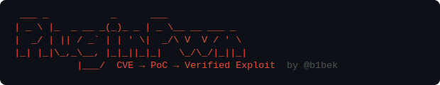

# PluginPwn



<p align="center">
  
  
  
</p>

<p align="center">
  End-to-end WordPress CVE exploit pipeline — from CVE ID to a verified, running exploit against an isolated Docker lab.
</p>

> **Note:** Supports WordPress **plugins** only. Theme CVEs are detected but not supported.

---

## How It Works

```
CVE ID → NVD Lookup → Plugin Download → AI PoC Generation → Docker Lab → Verified Exploit → Report
```

| Stage | What happens |
|---|---|
| **CVE Lookup** | Fetches vulnerability data from NVD (with cve.org fallback), auto-detects the plugin slug, pulls patch diffs from WordPress Trac |
| **Plugin Download** | Downloads the exact vulnerable version from wordpress.org |
| **PoC Generation** | Claude reads the plugin PHP source with tool-assisted code search and writes a working exploit, guided by the patch diff to target the exact vulnerable code path |
| **Docker Lab** | Spins up a clean WordPress + MariaDB environment with the vulnerable plugin installed and a custom mu-plugin for lab state setup |
| **Exploit & Verify** | Runs the exploit, uses AI to verify real impact was demonstrated — not just code path reached — and invokes an agent fixer if verification fails |
| **Report** | Saves a full JSON report to `reports/` and standalone exploit script to `exploits/`, written incrementally so partial results survive crashes |

---

## Requirements

- Python >= 3.12
- [uv](https://docs.astral.sh/uv/)
- [Docker](https://docs.docker.com/engine/install/) with Compose
- Anthropic API key

---

## Setup

```bash
git clone https://github.com/b1bek/PluginPwn.git
cd PluginPwn

# Install dependencies
uv sync

# Install Playwright browser (needed for some exploits)
uv run playwright install chromium

# Configure API key
cp .env.example .env
# Edit .env and set ANTHROPIC_API_KEY
```

---

## Usage

### Run the full pipeline

```bash
uv run python scan_plugins.py CVE-YYYY-XXXXX
```

Produces:
- `reports/CVE-YYYY-XXXXX.json` — full pipeline report
- `exploits/CVE-YYYY-XXXXX.py` — standalone exploit (on success)
- `exploits/CVE-YYYY-XXXXX_FAILED.py` — failed attempt (for debugging)

### Options

```
$ uv run python scan_plugins.py -h
usage: scan_plugins.py [-h] [--plugin PLUGIN] [--plugins-dir PLUGINS_DIR]
                       [-m MODEL] [--port PORT] [--skip-exploit]
                       [--verify POC_REPORT] [--setup-only] [--no-teardown]
                       [--no-ai] [--agent-retries N] [-o OUTPUT]
                       [cve_id]

WordPress CVE Exploit Pipeline — CVE lookup → download → PoC → exploit →
verify

positional arguments:
  cve_id                CVE identifier (e.g. CVE-YYYY-XXXXX)

options:
  -h, --help            show this help message and exit
  --plugin PLUGIN       WordPress plugin slug (auto-detected from CVE if
                        omitted)
  --plugins-dir PLUGINS_DIR
                        Path to plugins directory (default: plugins/)
  -m MODEL, --model MODEL
                        Claude model to use (default: claude-opus-4-6)
  --port PORT           Host port for the WordPress lab (default: 8777)
  --skip-exploit        Stop after PoC generation, don't run the exploit lab
  --verify POC_REPORT   Skip CVE lookup & PoC generation — run exploit lab
                        directly from an existing PoC report JSON
  --setup-only          With --verify: spin up the lab and install the plugin
                        but do not run the exploit
  --no-teardown         Keep Docker lab running after exploit (useful for
                        debugging)
  --no-ai               With --verify: skip all AI calls (verification and
                        agent fixer) — use exit code 0 as success
  --agent-retries N     How many times to invoke the agent fixer after
                        verification failure (default: 1)
  -o OUTPUT, --output OUTPUT
                        Save full pipeline report to JSON file
```

### Examples

```bash
# Run the full pipeline
uv run python scan_plugins.py CVE-YYYY-XXXXX

# Keep lab alive after exploit for inspection
uv run python scan_plugins.py CVE-YYYY-XXXXX --no-teardown

# Re-run exploit from an existing report (with AI verification)
uv run python scan_plugins.py --verify reports/CVE-YYYY-XXXXX.json

# Re-run with no AI calls — zero cost
uv run python scan_plugins.py --verify reports/CVE-YYYY-XXXXX.json --no-ai

# Spin up the lab and leave it running for manual testing
uv run python scan_plugins.py --verify reports/CVE-YYYY-XXXXX.json --setup-only

# Re-run with agent retries on failure
uv run python scan_plugins.py --verify reports/CVE-YYYY-XXXXX.json --agent-retries 2
```

---

## Sample Reports & Exploits

Sample reports and exploit scripts are included under `reports/` and `exploits/` — useful for inspecting output format or re-running an exploit without paying for PoC generation.

Tested against 35 CVEs — **26 successful exploits (74% success rate)**:

| Result | Count | Details |
|---|---|---|
| Exploit verified | 26 | Full end-to-end: CVE lookup through verified exploit |
| Exploit failed | 9 | Generated PoC did not achieve verified impact |

Successful exploits by vulnerability type:

| Vulnerability Type | Count | CVEs |
|---|---|---|
| SQL Injection | 6 | CVE-2023-23489, CVE-2025-1323, CVE-2025-5287, CVE-2025-6970, CVE-2025-12197, CVE-2026-3180 |
| Cross-Site Scripting (XSS) | 8 | CVE-2023-6970, CVE-2024-4041, CVE-2024-10646, CVE-2026-1252, CVE-2026-1608, CVE-2026-1825, CVE-2026-2420, CVE-2026-2433 |
| File Upload / RCE | 3 | CVE-2020-35489, CVE-2022-1329, CVE-2026-1357 |
| Authentication Bypass | 1 | CVE-2024-10924 |
| SSRF | 2 | CVE-2024-12365, CVE-2025-6851 |
| CSRF | 2 | CVE-2025-7965, CVE-2026-0658 |
| Arbitrary File Deletion | 1 | CVE-2025-14675 |
| Open Redirect | 1 | CVE-2025-39597 |
| PHP Object Injection | 1 | CVE-2026-2599 |
| Privilege Escalation | 1 | CVE-2026-1321 |

> **No API key?** `--verify --no-ai` requires no Anthropic key — just Docker.

---

## Docker Lab

Each run spins up a fresh, isolated WordPress environment:

| Component | Version |
|---|---|
| WordPress | 6.8 / PHP 8.2 / Apache |
| MariaDB | 10.11 |
| WP-CLI | Latest |

Pre-created lab users (username = password = role):

| Username | Role |
|---|---|
| `admin` | Administrator |
| `editor` | Editor |
| `author` | Author |
| `contributor` | Contributor |
| `subscriber` | Subscriber |

`WP_DEBUG` is enabled and database errors are surfaced — important for SQL injection exploits. The lab is torn down and volumes removed after each run (unless `--no-teardown`).

---

## AI Components

### PoC Generation

`claude-opus-4-6` reads the plugin source using three tools — `read_file`, `list_files`, `search_in_plugin` — across up to 25 turns. The patch diff from WordPress Trac is included in the prompt to point it directly at the vulnerable function. The system prompt is **cached** between turns to reduce cost by ~7×.

Output is structured JSON containing:
- Exploit script (standalone Python)
- Lab setup PHP (mu-plugin to prepare WordPress state)
- Attack prerequisites (auth level, nonce requirements)
- Verification criteria (exact observable evidence of success)

### Exploit Verification

`claude-haiku-4-5` checks the exploit output against the `verification_criteria` written by the PoC generator — what specific evidence proves the vulnerability was triggered. This avoids false positives (code path reached, 200 status) and false negatives (e.g. treating a cURL error as failure for SSRF).

### Agent Fixer

If verification fails, the Claude Agent SDK is invoked with access to the plugin source, a live Playwright browser connected to the lab, Docker logs, and read-only `wp` CLI access. It can edit both the exploit script and the lab mu-plugin. Syntax errors and runtime tracebacks are auto-fixed before AI verification. Supports multiple retries with memory of previous attempts (`--agent-retries`).

---

## Cost

Token usage and estimated USD cost are printed at the end of each run.

| Component | Model | Notes |
|---|---|---|
| PoC generation | `claude-opus-4-6` | Main cost driver; system prompt cached (~7× savings) |
| Exploit verification | `claude-haiku-4-5` | Cheap per-run check |
| Agent fixer | `claude-opus-4-6` (Agent SDK) | Only invoked on verification failure |

Running `--verify --no-ai` against an existing report costs nothing.

> **Note:** Cost estimates shown at the end of each run are approximate and may not reflect actual billing.

---

## Project Structure

```
plugin-pwn/
├── scan_plugins.py          # CLI entry point
├── scanner/
│   ├── config.py            # Model names, pricing, shared constants
│   ├── cve.py               # NVD lookup, plugin slug detection, Trac diff fetching
│   ├── poc_hunter.py        # Multi-turn Claude agent for PoC generation
│   ├── prompts.py           # System prompt with CWE-specific exploitation guidance
│   ├── tools.py             # Agent tool definitions (read_file, search_in_plugin, etc.)
│   ├── exploit_runner.py    # Pipeline orchestration, Docker management, AI verification
│   ├── agent_exploit.py     # Agent SDK fixer for failed exploits
│   ├── docker_lab.py        # Docker Compose helpers, lab lifecycle management
│   └── utils.py             # JSON extraction, API retry logic
├── docker/
│   ├── docker-compose.yml   # Base lab definition (WordPress + MariaDB + WP-CLI)
│   └── wp-setup.sh          # WP-CLI initialization (install, users, plugin activation)
├── reports/                 # JSON pipeline reports
├── exploits/                # Standalone exploit scripts
└── assets/                  # README assets
```

---

## Author

**Author:** @b1bek
